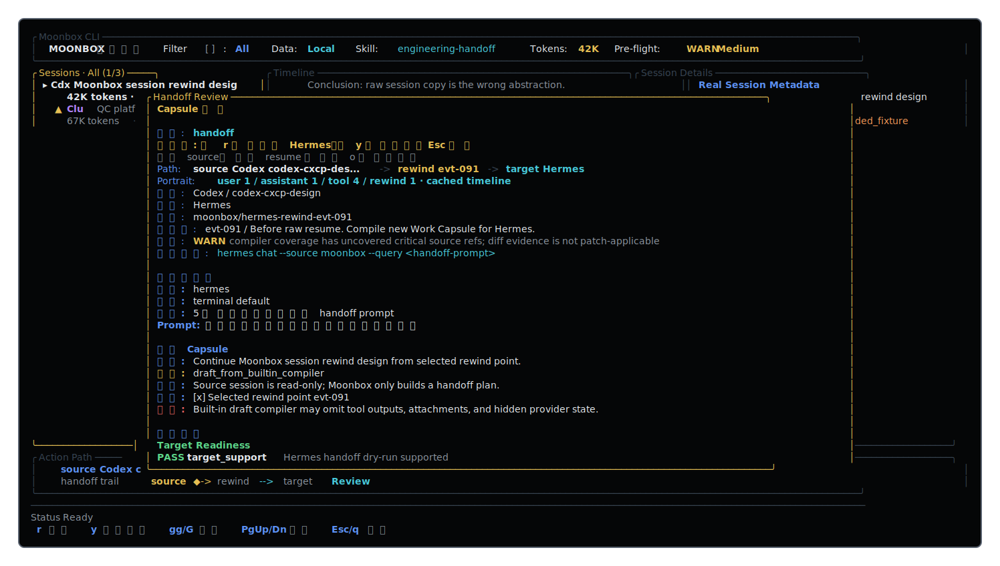

# Moonbox 月光宝盒

Moonbox is a cross-CLI session rewind workbench. It reads sessions from tools
such as Codex, Claude, and Hermes, normalizes them into a canonical timeline,
compiles a selected rewind point into a Work Capsule, and launches a new target
CLI branch.

This repository is intentionally not a raw session copier. The source session
is read-only. Compatibility and compression are delegated to replaceable
compiler skills.



## Install

### Cargo

Install the current repository version:

```bash
cargo install --git https://github.com/Gunsio/moonbox
moonbox --version
```

Moonbox also supports the shorter `moon` command. Until binary aliases are part
of a tagged release, create a local symlink:

```bash
mkdir -p ~/.local/bin
ln -sf "$(command -v moonbox)" ~/.local/bin/moon
moon --version
```

### Source Checkout

Requires Rust 1.88 or newer.

```bash
git clone https://github.com/Gunsio/moonbox.git
cd moonbox
cargo run -- tui
```

For local development:

```bash
cargo fmt --check
cargo check
cargo test
cargo clippy -- -D warnings
cargo build --release
```

### Homebrew

Homebrew distribution is planned, but not published yet. After the accepted
release is tagged, the intended install path is:

```bash
brew tap Gunsio/tap
brew install moonbox
```

See [docs/release/homebrew.md](docs/release/homebrew.md) for the release
checklist and formula shape.

## Project Standards

- [Contributing guide](CONTRIBUTING.md)
- [Security policy](SECURITY.md)
- [Changelog](CHANGELOG.md)
- [Homebrew release notes](docs/release/homebrew.md)

Pull requests are expected to pass formatting, check, test, clippy, and release
build gates. GitHub Actions runs the same Rust quality gates and validates the
README screenshot asset.

## Current State

The first implementation focuses on the product shell:

- Rust + Ratatui standalone binary
- High-density TUI workbench
- Vim-style keyboard navigation
- Time-sorted global session list with source tags
- Real Codex session discovery from `~/.codex/sessions`
- Runtime Codex home override via `MOONBOX_CODEX_HOME` or `CODEX_HOME`
- Runtime Codex list limit defaults to the newest 200 sessions; explicit session lookup still searches the full Codex store
- Set `MOONBOX_SESSION_LIMIT=0` for unlimited Codex list discovery
- Source filter defaults to `All`; `Source` is a session-list filter, not a global handoff mode
- Target selection lives inside the launch flow, with explicit `> [x]` radio-list selection
- Target picker validates each target as `READY`, `WARN`, or `BLOCKED`; blocked targets cannot confirm or copy launch commands
- Last confirmed target is persisted in `~/.config/moonbox/config.json`
- Real Codex timeline parsing plus fixture-backed Claude/Hermes sessions
- Original-session open command, Work Capsule, and branch tree previews
- Live `/` session search, combined filter display, and one-key clear with `a`
- Selected/filtered session drives timeline, Work Capsule, branch preview, token budget, and default rewind point
- Fixture fallback with branch, token count, health reason, and session-specific timeline/capsule content
- Fixed status line for action feedback
- Context-aware key bar for the current panel or modal
- Visible rewind marker in the timeline, plus rewind-aware branch and launch preview
- Timeline auto-scroll, Capsule/modal scroll, and small-terminal modal polish
- Copyable launch/original commands via `y` with OSC52 clipboard support
- Serializable core models for future adapters
- `SourceAdapter` contract and fixture-backed adapter fallback layer
- Fallible adapter discovery; bad source data returns structured errors instead of panics
- File-backed adapter fixtures for Codex, Claude, and Hermes session/timeline parsing
- `CapsuleCompiler` trait with fixture and process-backed compiler implementations
- External compiler skill runner via `MOONBOX_COMPILER`, JSON stdin/stdout, structured errors, and timeout handling
- Canonical Timeline and compiler request/output JSON contract fixtures
- Target launch dry-run plans with Work Capsule verification reports
- Single core verifier policy shared by CLI and TUI target validation
- `--capsule` reads a real Work Capsule JSON file when provided; generated dry-run capsules do not pretend to have a file path
- GitHub Actions CI for Rust quality gates and README screenshot validation
- Dependabot configuration for Cargo and GitHub Actions updates
- Contributing, security, changelog, issue template, and PR template docs

## Run

```bash
moonbox
moon
```

Useful commands:

```bash
cargo run -- tui
moon tui
cargo run -- tui --filter claude
cargo run -- tui --target codex
cargo run -- sessions --json
MOONBOX_SESSION_LIMIT=50 cargo run -- sessions --json
cargo run -- open --session <session-id>
cargo run -- capsule --json
cargo run -- compile-request --json
cargo run -- compile-output --json
cargo run -- compile-output --compiler <compiler-id> --json
cargo run -- launch --target hermes --session <session-id> --json
cargo run -- verify --target hermes --session <session-id> --capsule ./capsule.json --json
cargo run -- verify --target hermes --session hermes-cxcp-502 --json
```

`open`, `launch`, and `verify` currently print or validate plans; they do not
resume a real target process.

External compiler skills are optional. When configured, Moonbox sends a
`CapsuleCompileRequest` JSON object to the process stdin and expects a
`CapsuleCompileOutput` JSON object on stdout.

```bash
MOONBOX_COMPILER=/path/to/compiler \
MOONBOX_COMPILER_ID=engineering-handoff \
MOONBOX_COMPILER_ARGS='["--mode","handoff"]' \
MOONBOX_COMPILER_TIMEOUT_MS=30000 \
cargo run -- compile-output --compiler engineering-handoff --json
```

Without `MOONBOX_COMPILER`, Moonbox uses the built-in fixture compiler.

## Interaction Model

Moonbox has two separate actions for a selected session:

- `o`: open the original session with its original CLI.
- `enter`: choose a target CLI and prepare the handoff launch command.

The main screen is a global session entry point. Sessions are sorted by time and
tagged by source CLI. Source filtering is controlled by `f` or `[` / `]` and
starts at `All`. Target is not shown as a global mode on the main screen; it is
chosen only in the launch picker. In the target picker, `j/k` moves the pending
selection, `enter` confirms and persists it, and `Esc` / `q` cancels without
changing the saved target. The picker keeps every target visible and annotates
each option with `READY`, `WARN`, or `BLOCKED`; blocked targets keep the launch
command disabled until validation passes. The picker uses the same verifier
policy as the CLI, so `moon verify` and the TUI cannot disagree on target
readiness.

Session search matches id, title, cwd, source, branch, and health reason. When a
different session becomes selected by movement, source filter, or search,
Moonbox reloads that session's timeline, capsule preview, branch preview, and
recommended rewind point.

## TUI Keys

| Key | Action |
| --- | --- |
| `j` / `k` | Move selection |
| `gg` / `G` | Jump to top / bottom |
| `tab` / `shift-tab` | Switch panel |
| `/` | Filter sessions by text |
| `f` | Cycle session source filter |
| `o` | Open original session with original CLI |
| `[` / `]` | Previous / next session source filter |
| `space` | Set rewind point |
| `c` | Compile capsule |
| `v` | Verify capsule |
| `d` | Toggle diff preview |
| `s` | Cycle compiler skill |
| `enter` | Choose target and show handoff launch command |
| `:` | Command mode |
| `?` | Help |
| `q` / `Esc` | Back / quit |

### Target Picker Keys

| Key | Action |
| --- | --- |
| `j` / `k` | Move target selection |
| `enter` | Confirm target and remember it |
| `q` / `Esc` | Cancel without changing target |

## Architecture Direction

```text
Source Adapter -> Canonical Timeline -> Rewind Engine
      -> Capsule Compiler -> Verifier -> Target Launcher
```

Stable interfaces matter more than any single framework:

- `SourceAdapter`: read-only session parsing
- `CapsuleCompiler`: snapshot to Work Capsule; fixture and process runners exist now
- `Verifier`: schema, token, capability, and handoff checks; shared by CLI/TUI
- `SkillRunner`: JSON input/output compiler skill execution through a process runner
- `TargetLauncher`: create target CLI new branch, next real backend

## TODO

### Completed Milestones

- M0: action feedback, contextual keybar, visible rewind marker, clearer timeline selection.
- M1: modal/capsule scroll, copyable launch/original commands, small-terminal polish.
- M2: serializable core models, `SourceAdapter`, Canonical Timeline, compiler request/output fixtures.
- M3: session-driven detail panes with per-source fixtures and searchable branch/health metadata.
- M4: launch validation with target picker READY/WARN/BLOCKED states and blocked command confirmation/copy guards.
- M5: file-backed adapter fixture snapshots for Codex, Claude, and Hermes session/timeline parsing.
- M6: target launcher dry-run plus Work Capsule verification loop.
- M7: core boundary hardening with fallible adapters, shared verifier policy, real `--capsule` file validation, and a `CapsuleCompiler` trait.
- M8: open-source hygiene with CI, dependency automation, contribution docs, security policy, changelog, and GitHub templates.
- M9: real Codex `SourceAdapter` for `~/.codex/sessions`, runtime source registry, and bounded real-session discovery.
- M10: source architecture hardening with `WorkbenchData` naming, non-demo workbench APIs, and unbounded explicit Codex session lookup.
- M11: process-backed compiler skill runner with JSON stdin/stdout contract, timeout/failure handling, CLI `--compiler`, and real TUI compile action.

### Can Build Now

- Real Claude / Hermes Source Adapter implementations.
- Real target launcher execution behind the existing dry-run plan.

### Prototype Now, Improve With Real Data

- Launch preview: keep the command structure now, generate exact commands after real adapters exist.
- Session health badges: basic adapter status now, compute from real resume errors and compatibility signals later.

### Best After Real Session Data

- Real session discovery for Claude and Hermes.
- Target compatibility checks, disabled target options, and human-readable incompatibility reasons.
- Token budget and compression strategy previews.
- Tool-call, attachment, git diff, and compact-point restoration status.
- Real original-session launching instead of command preview/printing only.
