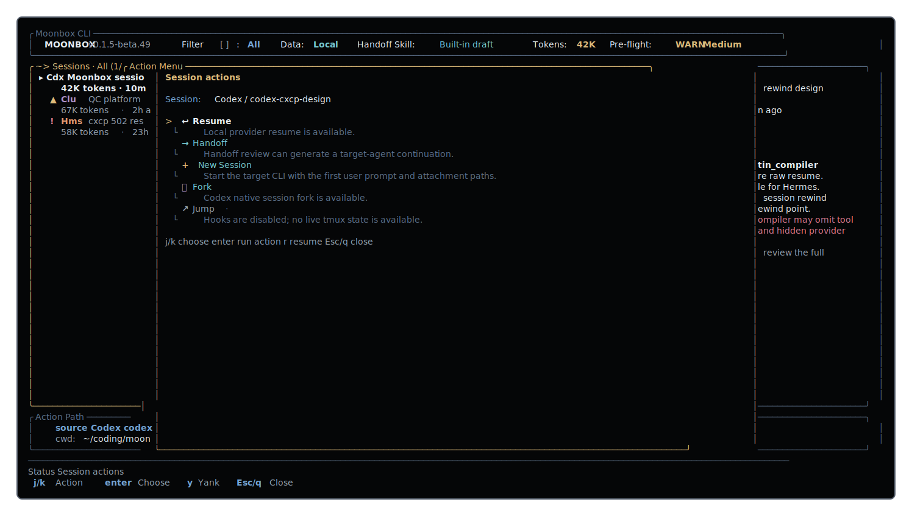
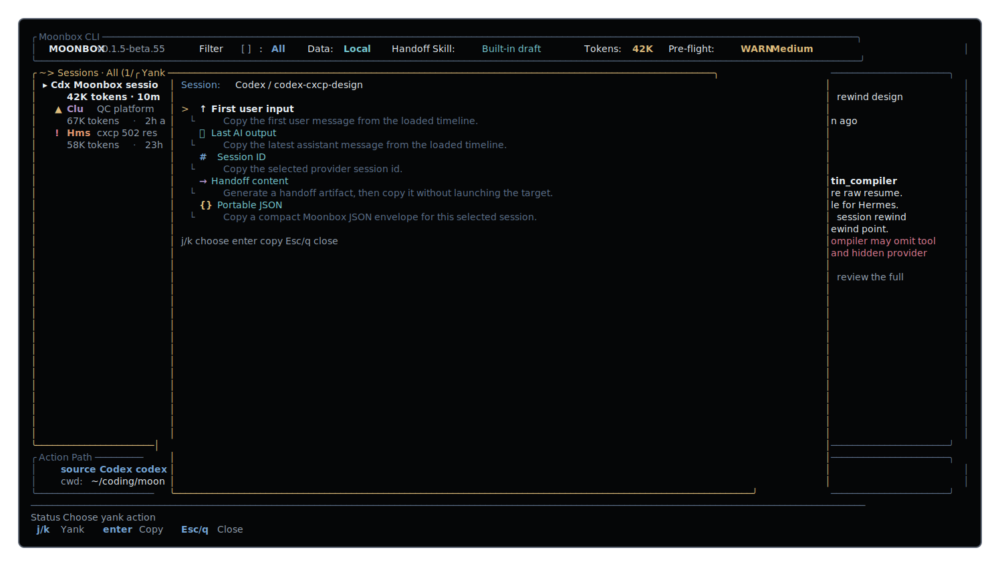
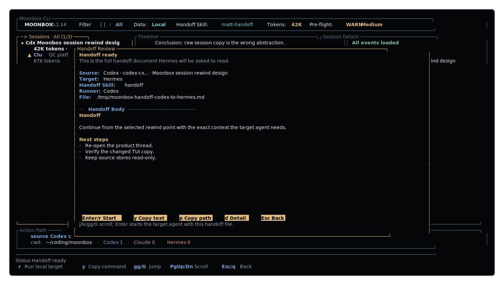
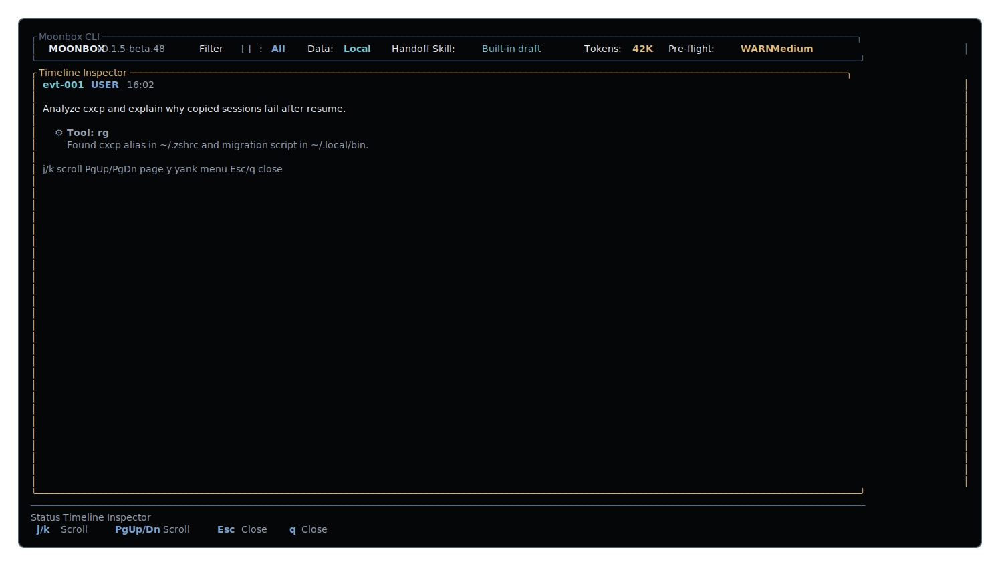

# Moonbox 月光宝盒



Moonbox is a cross-CLI AI coding session workbench for Codex, Claude, Hermes,
and local agent workflows. It helps you jump back to a useful moment, inspect
the surrounding timeline, shrink the work into a reviewed handoff, and continue
in the agent you actually want to use next.

It is built for people who switch between Codex, Claude, Hermes, and local
tooling but do not want their working memory trapped inside one provider's
resume picker.

Moonbox reads source session stores in read-only mode. It does not mutate
provider histories, send keystrokes, or resume source sessions unless you
explicitly ask it to run a guarded action.

## Quick Start

Install the bottled Homebrew release:

```bash
brew tap Gunsio/tap
brew trust --formula gunsio/tap/moonbox
brew install moonbox
```

Open the TUI and find the session you want to shrink into a handoff:

```bash
moon
```

Use `/` to search sessions, `o` to open the action menu, `x` or `H` to start a
handoff, and `o Enter` to create a Feishu/Lark handoff document when `lark-cli`
is ready.

For automation, export a handoff or create the Lark document from the CLI:

```bash
moon export --session <session-id> --to lark --mode handoff
moon export --session <session-id> --to lark --mode handoff --execute
```

## What It Does

- **Session inventory**: browse local Codex, Claude, and Hermes sessions in one
  time-sorted TUI.
- **Timeline rewind**: inspect turns, tool evidence, images, and compact
  boundaries before choosing where to continue.
- **Context health**: see provider-backed context usage, agent/model-resolved
  windows, quality-cliff estimates, and compact markers; unknown usage stays
  explicit instead of being turned into a fake percentage.
- **Action menu**: use `o` to pick Resume, Handoff, Lark Doc, New Session,
  Fork, Jump, Inspect, Yank, or Archive from one availability-aware menu.
- **Yank panel**: use `y` for copy-only workflows such as first user input,
  last AI output, session id, handoff text, and portable JSON.
- **Handoff review**: generate or review a continuation artifact before a target
  agent receives it.
- **Lark export**: preview or create a readable Feishu/Lark handoff document
  from the selected session in the TUI.
- **Themes and hotkeys**: Vim-style navigation, contextual footer hints, and the
  first-party Luoshen theme pack.

## Screenshots

### Yank Panel

`y` keeps common copy workflows fast and read-only.



### Handoff Review

Review the exact handoff document before starting a target agent.



### Timeline Details

Zoom into the timeline when the context matters more than the session list.



## Hotkeys

Moonbox is keyboard-first. The footer changes with the current mode, but the
core map stays predictable:

| Key | Action |
| --- | --- |
| `j` / `k` | Move through the active list |
| `gg` / `G` | Jump to top or bottom |
| `/` | Search sessions |
| `[` / `]` | Change source filter |
| `{` / `}` | Change data space |
| `o` | Open session actions |
| `y` | Open the Yank panel |
| `x` / `H` | Start handoff flow |
| `+` / `-` | Zoom and restore |
| `,` | Settings |
| `?` | Help |

## Themes

Moonbox ships with a semantic theme layer and a first-party Luoshen theme pack:

- `翩若惊鸿 / Startled Swan`
- `婉若游龙 / Coursing Dragon`
- `荣曜秋菊 / Radiant Chrysanthemum`
- `华茂春松 / Lush Pine`

Themes are selected in Settings with `,`. Theme changes affect only Moonbox UI;
session content, paths, prompts, tool output, and handoff artifacts remain
unchanged.

## Install Details

The package installs both `moonbox` and the short `moon` alias.

### Homebrew

Moonbox releases are distributed through the dedicated Homebrew tap. Apple
Silicon macOS uses a published bottle by default:

```bash
brew tap Gunsio/tap
brew trust --formula gunsio/tap/moonbox
brew install moonbox
moonbox --version
moon --version
```

See [docs/release/homebrew.md](docs/release/homebrew.md) for release and tap
maintenance details.

### Cargo

Install from Git:

```bash
cargo install --git https://github.com/Gunsio/moonbox
moonbox --version
moon --version
```

From a local checkout:

```bash
cargo install --path . --locked
```

Fixture-safe verification commands:

```bash
MOONBOX_SESSION_MODE=fixture moon sessions --json --filter codex
MOONBOX_SESSION_MODE=fixture moon doctor --json
moon completions zsh > /tmp/_moon
```

Create a Lark handoff document from the TUI with `o Enter`. Moonbox generates
the handoff with the configured runner, creates the Feishu/Lark document when
`lark-cli` is ready, or starts the install/update flow when it is not.

The same flow is available from CLI for automation:

```bash
moon export --session <session-id> --to lark --mode handoff
moon export --session <session-id> --to lark --mode handoff --execute
```

## Development

Requires Rust 1.88 or newer.

```bash
git clone https://github.com/Gunsio/moonbox.git
cd moonbox
cargo run --locked -- tui
```

Useful local gates:

```bash
cargo fmt --check
cargo test --locked
scripts/ci/docs-assets-smoke.sh
scripts/ci/full-gate.sh
```

The generated screenshots in this README come from the real Ratatui render
buffer. Refresh them with:

```bash
cargo run --locked -- docs-snapshot --scene action-menu --output docs/assets/moonbox-action-menu.svg
cargo run --locked -- docs-snapshot --scene yank --output docs/assets/moonbox-yank.svg
cargo run --locked -- docs-snapshot --scene handoff --output docs/assets/moonbox-handoff-review.svg
cargo run --locked -- docs-snapshot --scene timeline-details --output docs/assets/moonbox-timeline-details.svg
```

## Project Docs

- [Changelog](CHANGELOG.md)
- [Contributing guide](CONTRIBUTING.md)
- [Security policy](SECURITY.md)
- [Agent operating rules](AGENTS.md)

## Acknowledgements

Moonbox takes practical TUI inspiration from
[lazygit](https://github.com/jesseduffield/lazygit). The product metaphor and
name are inspired by the Moonlight Box in *A Chinese Odyssey* / 《大话西游》.
